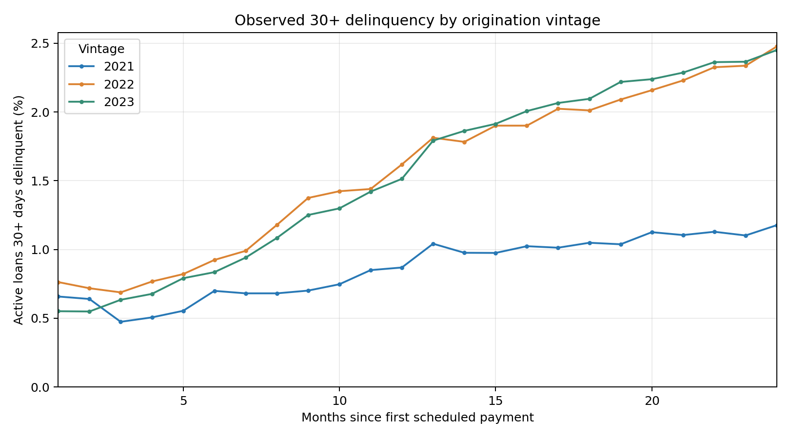

# Loan Vintage and Delinquency Monitor

A reproducible portfolio analysis of Freddie Mac's sampled 2021–2023 single-family mortgage vintages. It compares observed 30+ delinquency at the same months since first scheduled payment, with active-loan coverage, first observed 30+ events, original credit-score segments, monthly transitions, and payoff exits.

**Start here:** [Portfolio case study](CASE_STUDY.md) · [Full executed analysis and tables](output/analysis_report.md) · [Source SQL](analysis.sql) · [Python workflow](analyze.py)

At month 24, 30+ delinquency among observed active loans was **1.177%** (2021), **2.477%** (2022), and **2.451%** (2023). These descriptive results do not establish a policy effect. See the case study for denominators, limitations, and recommendations.

## Reproduce the analysis

1. Download the sample ZIPs `sample_2021.zip`, `sample_2022.zip`, and `sample_2023.zip` from [Freddie Mac's dataset page](https://www.freddiemac.com/research/datasets/sf-loanlevel-dataset) (registration may be required). Keep source data out of the Git repository.
2. Put the three ZIPs in a local `upload/` folder inside this repository.
3. Create a Python 3.10+ environment and install dependencies with `python -m pip install -r requirements.txt`.
4. Run `python analyze.py --input-dir upload --output-dir output`.

The script inspects the headerless pipe-delimited files, validates keys and documented missing codes, stages analytical rows in SQLite, runs the five queries in `analysis.sql`, and recreates the CSV results, quality log, report, and charts. The derived SQLite database is excluded from version control because it is approximately 290 MB and reproducible from the source ZIPs.

**Source and attribution:** Freddie Mac Single-Family Loan-Level Dataset sample; [General User Guide](https://www.freddiemac.com/fmac-resources/research/pdf/user_guide.pdf). The supplied files had 31 origination and 35 monthly performance fields. Verify layout against the release you download before running the workflow on other files. This repository does not redistribute source loan-level data.
