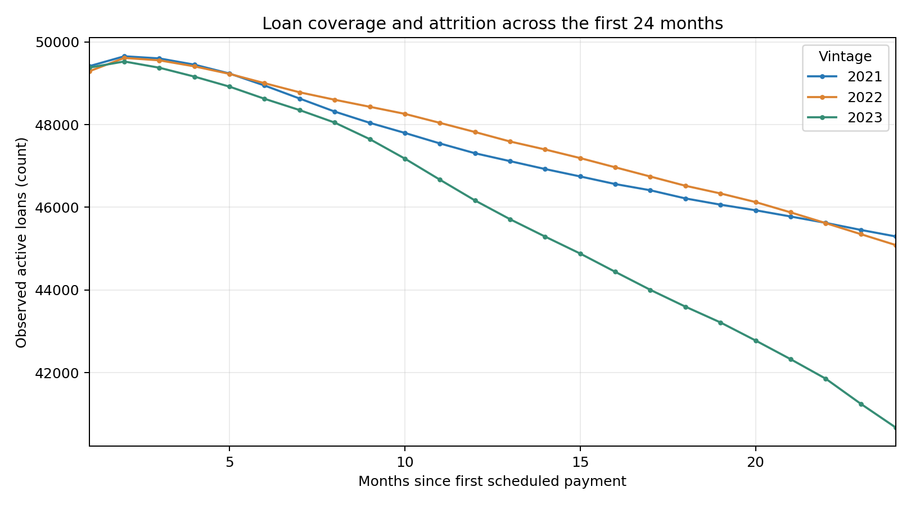
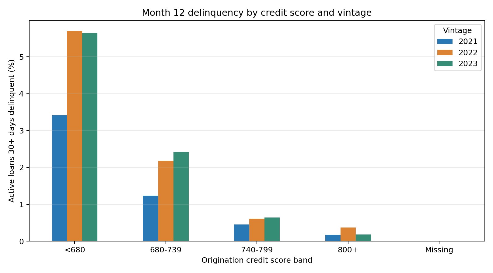

# Loan vintage and delinquency monitor: executed analysis

Source: supplied Freddie Mac single-family 2021–2023 sample ZIPs. Reporting cutoff: March 2026.

**Read this first:** 50,000 sampled originated loans per year. The annual file is an origination-year cohort. Rates below use only observed, active loan-months; their denominator shrinks with payoff and other exits. Descriptive associations do not identify a policy effect.

## 0. Raw inspection and quality checks

The original files have no headers. Each annual ZIP has 31-field origination and 35-field monthly performance records. Field counts are in `quality_report.json`; literal source row values and loan IDs are not exported. Input ZIPs are unchanged.

Original rows: {'2021': 50000, '2022': 50000, '2023': 50000}; monthly raw rows: {'2021': 2537054, '2022': 2034798, '2023': 1458169}.
Duplicate origination IDs: 0; duplicate loan-month keys in the analysis window: 0; internal monthly gaps within observed spells: 0; month-1 records: 148,408/150,000. Lack of a month-1 record does not necessarily mean an error: report timing or a prior exit may explain it.
Missing sentinels: credit score 9999 = 32; DTI 999 = 14. Source rows outside months 1–24 remain counted in the quality log but are not loaded into the analysis table.
Original score `9999`, DTI `999`, and LTV `999` are source-defined missing sentinels, converted to NULL. No credit score or DTI is imputed. Empty exit codes mean no recorded exit. `RA` is REO, not a numeric days-past-due value. Numerical status and positive UPB without an exit defines the active denominator.

**Assumptions to review:** (a) annual ZIP year defines vintage; (b) month 1 starts at first scheduled payment, not Freddie Mac's loan-age field (which can reset after modification); (c) the 24-month first-delinquency fraction uses loans with enough calendar follow-up; (d) no unobserved month is interpreted as current; (e) paid-off loans are separate from defaults; (f) the sample represents disclosed eligible Freddie Mac mortgages, not all applicants or all lending products.

## 1. How does observed delinquency change over months on book?

Calculation: `d30_n / active_n` by vintage and month. The SQL is query 1 in `analysis.sql`; Python draws the chart from its actual output.

| vintage_year | month_on_book | active_n | d30_n | pct_30_plus | exit_n |
| --- | --- | --- | --- | --- | --- |
| 2021 | 1 | 49411 | 325 | 0.658 | 79 |
| 2021 | 12 | 47307 | 411 | 0.869 | 236 |
| 2021 | 24 | 45296 | 533 | 1.177 | 158 |
| 2022 | 1 | 49288 | 376 | 0.763 | 100 |
| 2022 | 12 | 47820 | 774 | 1.619 | 221 |
| 2022 | 24 | 45087 | 1117 | 2.477 | 264 |
| 2023 | 1 | 49377 | 272 | 0.551 | 153 |
| 2023 | 12 | 46166 | 699 | 1.514 | 501 |
| 2023 | 24 | 40676 | 997 | 2.451 | 568 |

**What it shows:** at month 24 the active-loan 30+ rates are 1.177%, 2.477%, and 2.451% for 2021, 2022, and 2023 respectively. The 2023 denominator is 40,676 active loans versus 45,296 for 2021, so read the rate with the coverage chart. **What it does not show:** a causal cohort effect, portfolio-wide default probability, or outcomes for loans no longer active.

## 2. How many loans have a first observed 30+ month by 24 months?

Calculation: distinct eligible loans with at least one observed 30+ month in 1–24 divided by all loans with 24 calendar months available at the cutoff. SQL query 2.

| vintage_year | eligible_loans | ever_30_n | pct_ever_30_observed |
| --- | --- | --- | --- |
| 2021 | 50000 | 3252 | 6.504 |
| 2022 | 49998 | 4577 | 9.154 |
| 2023 | 49964 | 3874 | 7.754 |

**What it shows:** observed first-24-month 30+ event fractions are 6.504%, 9.154%, and 7.754%. **What it does not show:** that all other loans stayed current throughout; especially, terminated loans have shorter observed spells. This is not a survival estimate.

## 3. Does observed month-12 delinquency vary by origination credit score?

Calculation: active 30+ rate in month 12 by original FICO band, with missing score separate. SQL query 3.

| vintage_year | fico_band | observed_rows | active_n | d30_n | pct_30_plus |
| --- | --- | --- | --- | --- | --- |
| 2021 | 680-739 | 13462 | 13390 | 165 | 1.232 |
| 2021 | 740-799 | 24036 | 23937 | 108 | 0.451 |
| 2021 | 800+ | 6281 | 6250 | 11 | 0.176 |
| 2021 | <680 | 3758 | 3723 | 127 | 3.411 |
| 2021 | Missing | 7 | 7 | 0 | 0.0 |
| 2022 | 680-739 | 15063 | 14982 | 327 | 2.183 |
| 2022 | 740-799 | 23331 | 23249 | 142 | 0.611 |
| 2022 | 800+ | 4550 | 4532 | 17 | 0.375 |
| 2022 | <680 | 5090 | 5050 | 288 | 5.703 |
| 2022 | Missing | 7 | 7 | 0 | 0.0 |
| 2023 | 680-739 | 13594 | 13461 | 326 | 2.422 |
| 2023 | 740-799 | 24186 | 23934 | 154 | 0.643 |
| 2023 | 800+ | 5091 | 5036 | 9 | 0.179 |
| 2023 | <680 | 3783 | 3721 | 210 | 5.644 |
| 2023 | Missing | 14 | 14 | 0 | 0.0 |

**What it shows:** within each vintage, the <680 band has a higher observed month-12 30+ rate than the 800+ band (2022: 5.703% vs 0.375%, with 5,050 vs 4,532 active loans). **What it does not show:** the effect of changing a score or lending policy; origination selection, state, LTV and exits may confound comparisons. The tiny missing-score bands are not interpretable as zero risk.

## 4. How often do observed delinquency states change between adjacent months?

Calculation: one transition per consecutive, active pair; aggregate current/30+ states. SQL query 4.

| vintage_year | from_group | to_group | transition_n |
| --- | --- | --- | --- |
| 2021 | 30+ to next month | 30+ | 5316 |
| 2021 | 30+ to next month | Current | 3864 |
| 2021 | Current to next month | 30+ | 4158 |
| 2021 | Current to next month | Current | 1074805 |
| 2022 | 30+ to next month | 30+ | 10955 |
| 2022 | 30+ to next month | Current | 5525 |
| 2022 | Current to next month | 30+ | 6459 |
| 2022 | Current to next month | Current | 1070041 |
| 2023 | 30+ to next month | 30+ | 10894 |
| 2023 | 30+ to next month | Current | 4458 |
| 2023 | Current to next month | 30+ | 5448 |
| 2023 | Current to next month | Current | 1028500 |

**What it shows:** for the 2022 vintage, 5,525 of 16,480 active 30+ transitions went to current next month (33.5% of such transitions). The same loan can contribute many transitions. **What it does not show:** recovery after exit, transitions across missing months, or a person-level cure probability over the full loan lifetime.

## 5. Why do loans leave observation in the first 24 months?

Calculation: source zero-balance codes summarized independently from delinquency. SQL query 5.

| vintage_year | zero_balance_code | exit_type | exits |
| --- | --- | --- | --- |
| 2021 | 01 | Prepaid/matured | 4576 |
| 2021 | 96 | Defect | 103 |
| 2021 | 09 | REO disposition | 1 |
| 2021 | 02 | Third-party sale | 1 |
| 2022 | 01 | Prepaid/matured | 4612 |
| 2022 | 96 | Defect | 229 |
| 2022 | 02 | Third-party sale | 3 |
| 2022 | 09 | REO disposition | 2 |
| 2022 | 03 | Short sale/charge-off | 1 |
| 2023 | 01 | Prepaid/matured | 8983 |
| 2023 | 96 | Defect | 201 |
| 2023 | 09 | REO disposition | 8 |
| 2023 | 02 | Third-party sale | 5 |
| 2023 | 03 | Short sale/charge-off | 3 |
| 2023 | 15 | Whole-loan sale | 1 |

**What it shows:** code 01 accounts for 4,576, 4,612, and 8,983 first-24-month exits in the three vintages; the large 2023 count helps explain the lower active denominator. **What it does not show:** gross/net credit loss or the reason for the difference in payoff rates; code `01` is voluntary payoff/maturity and is not default.

## Suggested business follow-up

Inspect the cohort/score cells with the largest *observed* delinquency and adequate denominator, then ask servicing and risk teams whether policy, borrower mix, reporting gaps or external conditions changed. Validate against the full portfolio before adjusting underwriting. Keep separate dashboards for 30+, exit mix, and observed loan coverage.

## Reproduction

`python analyze.py --input-dir ../upload --output-dir output` from this directory. The script runs `analysis.sql` in SQLite and exports all five result tables as CSV. Full quality counts are in `quality_report.json`.